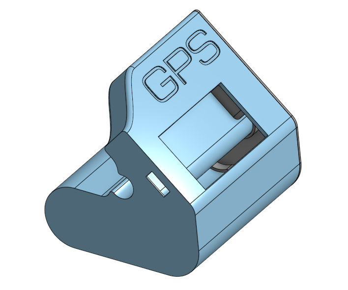

# MopoSpeedo — GPS speedometer for LILYGO T-Display S3

ESP32-S3 (LILYGO **T-Display S3**) + GPS = a clean, sunlight-readable speedometer for a moped.

- Big **km/h** (turns **red** > 45 km/h)
- Right panel: **direction arrow** + **heading** (000–359)
- Top bar: **battery volts** & **%**, **satellite count**
- **GPS fix & HDOP** shown on screen
- **ODO & TRIP** (persisted), **TRIP reset** via web
- **Oil-change reminder** every **300 km** (reset via web)
- Built-in **Wi-Fi AP** with a simple status/debug page
- Splash: *HONDA / Monkey 1994* + *“All code generated by ChatGPT 5”*

> Arduino IDE project using `TinyGPSPlus`, `TFT_eSPI`, `Preferences`, and ESP32-core `WebServer`.

---

## Hardware

- **MCU/Display:** LILYGO **T-Display S3** (ESP32-S3 + 1.9" TFT)
- **GPS module:** CASIC **AT6558R** (URANUS5) or any NMEA GNSS (also works with u-blox)
- **Power:** 1S **LiPo**
- **Antenna:** passive patch (prefer a **metal ground plate** under it) or active GPS antenna

### Wiring

| GPS module | ESP32-S3 (T-Display S3) |
| --- | --- |
| **TX** | **GPIO16** (MCU RX) |
| **RX** | **GPIO21** (MCU TX, optional) |
| **GND** | GND |
| **VCC** | **3.3 V** (do not feed 5 V) |

> Display power on battery: the sketch drives **GPIO15 = HIGH** (LCD power enable) and **GPIO38 = HIGH** (backlight).

---

## Build

1. **Arduino IDE 2.x** recommended.  
   Boards Manager → install **ESP32 by Espressif** (S3 support).
2. Libraries:
   - `TinyGPSPlus`
   - `TFT_eSPI` → in `User_Setup_Select.h` enable  
     `#include <User_Setups/Setup206_LilyGo_T_Display_S3.h>`
3. Typical board settings:
   - Board: **ESP32S3 Dev Module** (or **LILYGO T-Display S3** if present)
   - Flash Mode **QIO 80 MHz**, PSRAM **OPI PSRAM**
   - USB CDC On Boot: Enabled (for Serial Monitor)
   - Partition: *Default 4MB with spiffs*
4. Flash the sketch, open **Serial Monitor @ 115200**.

---

## Use

### Screen
- **km/h** centered left (red > 45 km/h, **grey** when fix isn’t good yet).
- Right panel: **arrow + heading**, bottom shows **FX:2D/3D** and **HDOP**.

### Wi-Fi AP
- SSID: **MopoSpeedo**, password: **mopo12345**
- Open `http://192.168.4.1/`

Page features:
- **ODO & TRIP** (+ **reset TRIP**)
- **Oil-change reminder** (+ reset)
- **Battery**, **satellites**, **fix**, **HDOP**, **GPS baud**
- **Service manual link** (Honda Monkey Z50J 1992–99 PDF)
- **Debug tools**:
  - **NMEA debug** (USB ↔ GPS serial bridge)
  - **Scan GPS baud**
  - **Enable NMEA GGA/GSA/GSV/RMC/VTG** (CASIC/u-blox aware)
  - **Set GPS baud** to 38400 / 115200 (CASIC `PCAS01`)

---

## How speed is computed (short)

- Read GPS **ground speed** via TinyGPS++: `gps.speed.kmph()` (usually 1 Hz).
- Show/use speed only when **hasFixStrong()** is true:  
  fresh location (< 2 s), **satellites ≥ 3**, **HDOP < 10**.
- Apply **exponential smoothing** to reduce flicker:  
  `filtered = α*raw + (1-α)*prev` (`SPEED_FILTER_ALPHA`).
- **ODO/TRIP** are integrated from GPS positions (`TinyGPSPlus::distanceBetween`),  
  only when speed ≥ threshold (to avoid drift) and with single-tick spike clamp.

The source is thoroughly commented near the top.

---

## Quick tips for fast fix

- Do the first fix **outdoors**; place patch antenna **flat** with a **metal ground** under it.
- If NMEA looks garbled at 9600, set GPS to **38400** or **115200** (web buttons).
- Ensure core sentences (GGA/GSA/GSV/RMC/VTG) are **enabled** (use the **Enable NMEA** button).
- Keep GPS away from ESP32 and the TFT backlight step-up (EMI). Common **GND** is required.
- If your module has **backup battery (VBAT)**, connect it → warm starts are much faster.

---

## Files

- `*.ino` — Arduino sketch
- `case.png` — enclosure render (see top)

---

## Credits

- LILYGO **T-Display S3**
- TinyGPSPlus, TFT_eSPI  
- **All code generated by ChatGPT 5**

